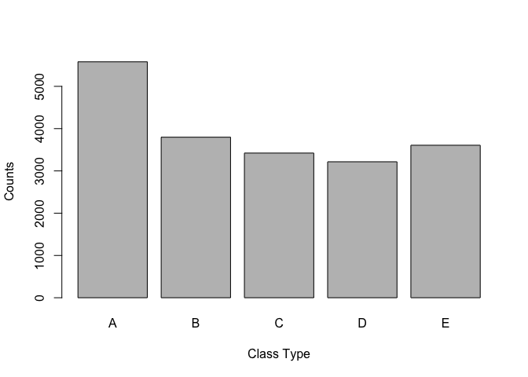

# Practical Machine Learning Project
==
By SherryLL Nov 23th, 2014
---

# Introduction and Synonpsis 

Using devices such as Jawbone Up, Nike FuelBand, and Fitbit it is now possible to collect a large amount of data about personal activity relatively inexpensively. These type of devices are part of the quantified self movement – a group of enthusiasts who take measurements about themselves regularly to improve their health, to find patterns in their behavior, or because they are tech geeks. One thing that people regularly do is quantify how much of a particular activity they do, but they rarely quantify how well they do it. 

In this project, my goal is to use data from accelerometers on the belt, forearm, arm, and dumbell of 6 participants. They were asked to perform barbell lifts correctly and incorrectly in 5 different ways. More information is available from the website here: http://groupware.les.inf.puc-rio.br/har (see the section on the Weight Lifting Exercise Dataset). 

In the project, I developed a model based on random forest algorithm to predict the manner in which they did the exercise. The out of sample error is more than 99%, demonstrating very good prediction. Besides, the model was used to predict 20 different test cases and 20/20 accuracy was obtained. 

# Data Processing
## Download the data

```r
setwd("~/Practical-Machine-Learning-Project/")
if (!"pml-training.csv" %in% dir("./Data/")) {
    download.file("http://d396qusza40orc.cloudfront.net/predmachlearn/pml-training.csv", "./Data/pml-training.csv")
}
if (!"pml-testing.csv" %in% dir("./Data/")) {
    download.file("http://d396qusza40orc.cloudfront.net/predmachlearn/pml-testing.csv", "./Data/pml-testing.csv")
}
```
## Read the data
First, read csv format of the data:

```r
if (!"trainData" %in% ls()) {
    trainData <- read.csv("./Data/pml-training.csv", sep = ",", na.strings=c("NA",""))
}
if (!"testData" %in% ls()) {
    testData <- read.csv("./Data/pml-testing.csv", sep = ",")
}
```
Second, check the dimensions of the datasets:

```r
dim(trainData)
```

```
## [1] 19622   160
```

```r
dim(testData)
```

```
## [1]  20 160
```
## Clean the data
First, clean the data by removing the NA columns

```r
colNAnumber <- colSums(is.na(trainData))       
colNA <- colNAnumber >= 19216  
trainData <- trainData[!colNA]    

colNAnumber <- colSums(is.na(testData)) 
colNA <- colNAnumber >= 20    
testData <- testData[!colNA]
```
Second, remove the first 6 columns which are not related to the analysis and modeling

```r
trainData <- trainData[, -c(1:6)]
testData <- testData[, -c(1:6)]
```
# Exploratory Data Analysis

```r
plot(trainData$classe, xlab = "Class Type", ylab = "Counts")
```

 

# Build the Model

```r
library(knitr)
library(Hmisc)
```

```
## Loading required package: grid
## Loading required package: lattice
## Loading required package: survival
## Loading required package: splines
## Loading required package: Formula
## 
## Attaching package: 'Hmisc'
## 
## The following objects are masked from 'package:base':
## 
##     format.pval, round.POSIXt, trunc.POSIXt, units
```

```r
library(caret)
```

```
## Loading required package: ggplot2
## 
## Attaching package: 'caret'
## 
## The following object is masked from 'package:survival':
## 
##     cluster
```

```r
library(randomForest)
```

```
## randomForest 4.6-10
## Type rfNews() to see new features/changes/bug fixes.
## 
## Attaching package: 'randomForest'
## 
## The following object is masked from 'package:Hmisc':
## 
##     combine
```

```r
library(foreach)
library(doParallel)
```

```
## Loading required package: iterators
## Loading required package: parallel
```

```r
library(e1071)
```

```
## 
## Attaching package: 'e1071'
## 
## The following object is masked from 'package:Hmisc':
## 
##     impute
```

```r
classify <- createDataPartition(y = trainData$classe, p = 0.6, list = FALSE)
trainData2 <- trainData[classify, ]
testData2 <- trainData[-classify, ]
```


```r
# I tried train function in Caret package first, it works but takes very long time. Then I change to parallel analysis method, which saves a lot of time
# trainInds <- sample(nrow(trainData2), 1000)
# trainData2<-trainData2[trainInds,]
# fitting <- train(classe ~ ., data = trainData2, prox = TRUE)

registerDoParallel()
classe <- trainData2$classe
variables <- trainData2[-ncol(trainData2)]
fitting <- foreach(ntree = rep(250, 4), .combine = randomForest::combine, .packages = 'randomForest') %dopar% {
randomForest(x = trainData2[-ncol(trainData2)], y = trainData2$classe, ntree=ntree) 
}
```
# Model Evaluation
## Expected Out of Sample Error 

```r
test <- predict(fitting, testData2)
confusionMatrix(test, testData2$classe)
```

```
## Confusion Matrix and Statistics
## 
##           Reference
## Prediction    A    B    C    D    E
##          A 2231    1    0    0    0
##          B    0 1513    4    0    0
##          C    0    4 1363    7    0
##          D    0    0    1 1278    4
##          E    1    0    0    1 1438
## 
## Overall Statistics
##                                           
##                Accuracy : 0.9971          
##                  95% CI : (0.9956, 0.9981)
##     No Information Rate : 0.2845          
##     P-Value [Acc > NIR] : < 2.2e-16       
##                                           
##                   Kappa : 0.9963          
##  Mcnemar's Test P-Value : NA              
## 
## Statistics by Class:
## 
##                      Class: A Class: B Class: C Class: D Class: E
## Sensitivity            0.9996   0.9967   0.9963   0.9938   0.9972
## Specificity            0.9998   0.9994   0.9983   0.9992   0.9997
## Pos Pred Value         0.9996   0.9974   0.9920   0.9961   0.9986
## Neg Pred Value         0.9998   0.9992   0.9992   0.9988   0.9994
## Prevalence             0.2845   0.1935   0.1744   0.1639   0.1838
## Detection Rate         0.2843   0.1928   0.1737   0.1629   0.1833
## Detection Prevalence   0.2845   0.1933   0.1751   0.1635   0.1835
## Balanced Accuracy      0.9997   0.9980   0.9973   0.9965   0.9985
```
From this analysis, we can see that the expected out of sample error accurary is more than 99%, demonstrating very good prediction.

## Model Test Cases

```r
answers <- predict(fitting, testData)
answers <- as.character(answers)
```
Upon submission, 20/20 score was obtained, indicating that this model developed is very help for prediction.
